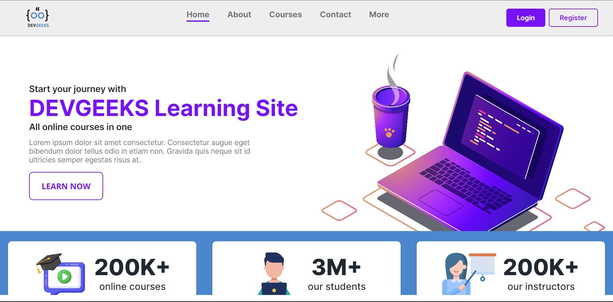

<h1 align='center'>Documentation</h1>

<!-- collaborator titles  -->
<h2 align=center>:rocket: Collaborators :rocket:</h2>
<h3 align=center>:star::star::star::star::star:</h3>
<!-- collaborators  -->
<div align=center>

| Hein Htet San | Wai Yan Tun | Lynn Myat Bhone |
|-------|------|------|
||||
|[**Follow**](https://github.com/Hein-HtetSan) |[**Follow**](https://github.com/sayrgyiwoody)|[**Follow**](https://github.com/Lynn-Myat-Bhone)|

| Kyaw Thuta Oo | Pyae Phyo Maung | Htet Aung Hlyan |
|-------|------|------|
||||
|[**Follow**](https://github.com/CodingbyKira)|[**Follow**](https://github.com/Pyae-PhyoMaung)|[**Follow**](https://github.com/HAstral)|

</div>
<!-- end of collaborators  -->

<hr>
<h2>Project Title</h2>

# Dev Geeks Learning Web Application



Deployment - [Demo](https://devgeeksmyanmar.github.io/learning_app/#)

<h2>Project Scope and Objectives<h3>

<h3>Outline :fire:</h3>

**Analyzing App Idea** :chart:
> The idea of project intend to increase demand for accessible and hight-quality learning opportunity. Our team want to provide a platform where people can easily access varitey of courses and gains skills. So, we decided to build a user-friendly learning web app.

**Research** ⌛
> We did a lot of research on the internet. Inspiring the learning platform like Udemy, Coursea, Freecodecamp and so on. We also considered the best user experience ever.

**Sketch** :pen:
> Before we started, we made researches on how the application was supposed to be and also considering that fact, and we did sketch up the raw design on Figma first. You can also check [**Here**](https://www.figma.com/file/0R09UfQfn3ZMhMAOb9cxTu/Language_app?type=design&node-id=0%3A1&mode=design&t=9I7Zvkau6eJeKGhe-1).


<h3>Features :fire:</h3>
<ul>
    <li>Best User Experience ever.</li>
    <li>Course Catalog</li>
    <li>Course Listings</li>
    <li>Enrollment</li>
    <li>Video Lessons</li>
    <li>Discussion Forums</li>
    <li>Instructor Interaction</li>
    <li>Certification of Completion</li>
    <li>Progress Tracking</li>
    <li>Mobile App</li>
    <li>Feedback and Ratings</li>
    <li>Specialization or Learning Paths</li>
</ul>

<h3>Project Structure :fire:</h3>

```
├── assets
│   ├── css
│   ├── images
│   ├── js
│   ├── pic
│   ├── scss
│   └── svg
├── node_modules
├── view
│   └── file/*
├── index.html
├── README.md
├── package-lock.json
└── package.json
```


<h2>Technology Stack</h2>

<h3>Languages</h3>
<ul>
    <li><b>HTML5</b> - HyperText Markup Language</li>
    <li><b>CSS3</b> - Cascading Style Sheets</li>
    <li><b>JavaScript ES6</b> - Scripting programming language</li>
    <li><b>SASS</b> - Syntactically Awesome Style Sheets</li>
    <li><b>JQuery</b> - JavaScript Library</li>
</ul>

<h3>Frameworks</h3>
<ul>
    <li>Bootstrap 5</li>
    <li>ScrollReveal Js</li>
    <li>Swiper Js</li>
</ul>

<h2>WireFraming & Design</h2>
<ul>
    <li>Figma</li>
    <li>Fontawesome Icons</li>
    <li>Bootstrap Icons</li>
    <li>Pinterest</li>
    <li>Dribble</li>
    <li>Behance</li>
    <li>Pexel</li>
</ul>

<span> You can also check <a href="https://www.figma.com/file/0R09UfQfn3ZMhMAOb9cxTu/Language_app?type=design&node-id=0%3A1&mode=design&t=9I7Zvkau6eJeKGhe-1">Design File</a>.</span>

<h2>Management Source Code</h2>
<ul>
    <li>Git</li>
    <li>GitHub</li>
</ul>

<span>
    Here is the <a href="https://github.com/DevGeeksMyanmar/learning_app">Code</a> and you can also contribute or collaborate with our team. Warmly welcome! :smile:
</span>
